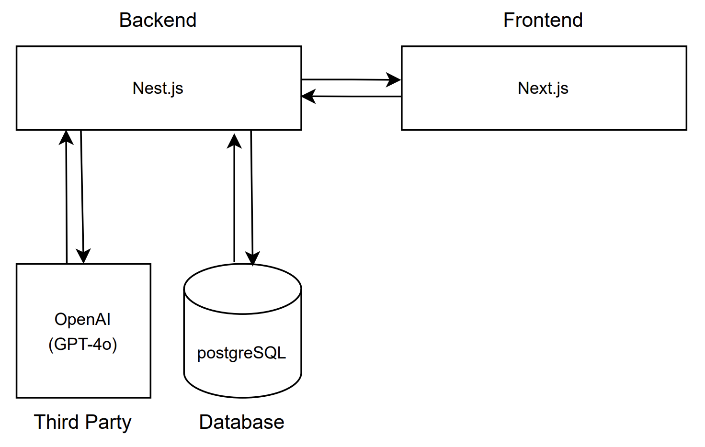

# Buena Property Management - Technical Summary

## Architecture Diagram

## Technology Choices & Rationale

### Frontend Technologies

#### Core Framework & Language
- **Next.js** 14.0.0 - Chose Next.js over Vite because I needed SSR and built-in API routes for this full-stack app.
- **React** 18.2.0 - Picked React over Vue/Angular for its massive ecosystem and job market relevance.
- **TypeScript** 5.3.3 - Went with TypeScript over JavaScript to catch errors at compile-time rather than runtime.

#### State Management
- **Redux Toolkit** - Chose Redux Toolkit with RTK Query over Zustand because I needed robust API caching and normalized state management.
- **React Redux** - Official bindings required for Redux integration.

#### UI Components
- **Radix UI** - Picked Radix UI over Material UI because I wanted full styling control without fighting pre-styled components.
- **lucide-react** - Chose lucide-react over react-icons for its modern, consistent design and smaller bundle size.

#### Styling
- **Tailwind CSS** - Went with Tailwind over CSS-in-JS/Bootstrap for faster development and avoiding runtime style injection.

#### Forms & Validation
- **React Hook Form** - Chose React Hook Form over Formik because it causes fewer re-renders and has better performance.
- **Zod** - Picked Zod over Yup for its superior TypeScript integration and type inference.

#### Testing
- **Jest** - Went with Jest over Vitest because it's more mature and has better ecosystem support for React Testing Library.
- **React Testing Library** - Standard for testing React components based on user behavior rather than implementation.

### Backend Technologies

#### Core Framework
- **NestJS** 10.3.0 - Chose NestJS over raw Express because I needed a structured, scalable architecture with dependency injection.
- **TypeScript** 5.3.3 - Maintained type safety across the entire stack from database to frontend.
- **Express** - Comes bundled with NestJS as the HTTP layer.

#### File Processing
- **Multer** - Industry-standard middleware for handling file uploads in Node.js.
- **pdf-extraction** - Picked pdf-extraction over pdf-parse after encountering browser API dependency issues with pdf-parse.

#### AI Integration
- **OpenAI API** (GPT-4o) - Chose OpenAI over other AI services for GPT-4o's superior understanding of complex German legal documents.

#### Testing
- **Jest** - Used Jest on the backend to keep the testing stack consistent across frontend and backend.
- **@nestjs/testing** - Built-in NestJS utilities for testing modules and dependency injection.

### Database Technologies

- **PostgreSQL** 16 - Reliable, production-grade relational database with excellent Prisma support.
- **Prisma** 5.8.0 - Went with Prisma over TypeORM because there are a lot of bad comments about TypeORM on the internet and Prisma's type safety is superior.

### Infrastructure

- **Docker** - Chose Docker over local setup for consistent development environments and easier deployment.
- **Docker Compose** - Orchestrates multiple containers with a single config file instead of managing services separately.

## Design Choices

### Color Palette

### Font Family - Inter

## Key Features

### 1. PDF Parsing with AI
- Upload Teilungserklärung (Declaration of Division) PDFs
- Extract property, building, and unit information using OpenAI
- Auto-fill property creation wizard

### 2. Property Management
- Create properties with multiple buildings
- Add units to buildings
- Manage property managers and accountants
- Full CRUD operations

### 3. Efficient Unit Management
- Bulk CSV import
- Pattern-based generation
- Table view with inline editing
- Quick add mode
