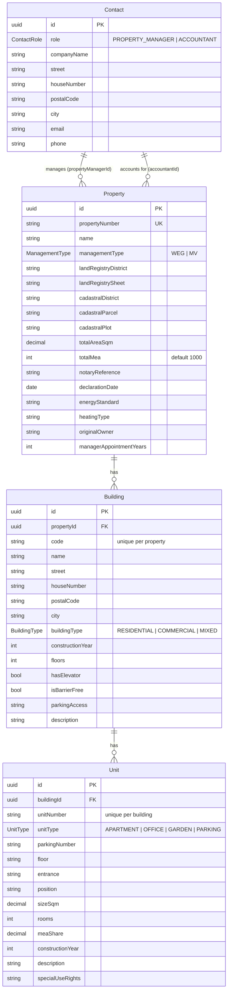

# Backend architecture

The backend is a NestJS 10 application that exposes a REST API over a PostgreSQL database through Prisma. It has no authentication layer; it is designed to sit behind the Next.js frontend on a trusted network.


## Module layout

```
src/
├── main.ts                      bootstrap: CORS, global ValidationPipe, port
├── app.module.ts                imports the four feature modules
├── prisma/
│   ├── prisma.module.ts
│   └── prisma.service.ts        PrismaClient wrapper with connect/disconnect hooks
├── properties/
│   ├── properties.controller.ts
│   ├── properties.service.ts
│   ├── pdf-parser.service.ts    PDF text extraction + OpenAI structured output
│   └── dto/                     CreatePropertyDto (with nested buildings/units), UpdatePropertyDto
├── buildings/                   controller, service, dto/
├── units/                       controller, service, dto/
└── contacts/                    controller, service, dto/
```

Every feature module follows the same shape: a controller that maps HTTP routes to a service, a service that talks to `PrismaService`, and DTO classes decorated with `class-validator` rules. Each file has a sibling `*.spec.ts` unit test.

## Request flow

1. `main.ts` registers a global `ValidationPipe` with `whitelist`, `forbidNonWhitelisted` and `transform` enabled. Unknown body fields are rejected with 400, and query/body primitives are coerced to the DTO types (`enableImplicitConversion`).
2. The controller receives the validated DTO and delegates to the service.
3. The service performs existence checks (throwing `NotFoundException` for unknown ids or missing parents) and runs the Prisma query.
4. Responses return the Prisma result directly, including the related records listed below.

CORS is limited to `http://localhost:3000`, `http://127.0.0.1:3000` and the Docker service name `http://frontend:3000`.

## REST endpoints

| Method | Path | Notes |
| --- | --- | --- |
| `POST` | `/properties` | Creates a property with optional nested `buildings[]`, each with optional nested `units[]`, in a single Prisma create. Duplicate `propertyNumber` is reported with a clear message. |
| `POST` | `/properties/parse-pdf` | Multipart upload (`file`), PDF only, 10 MB limit. Returns `ParsedPropertyData`. |
| `GET` | `/properties` | All properties, newest first, with manager, accountant, buildings and units. |
| `GET` | `/properties/:id` | One property with the same includes. |
| `PATCH` | `/properties/:id` | Partial update of scalar fields. |
| `DELETE` | `/properties/:id` | Cascades to buildings and units. |
| `POST` | `/buildings` | Requires an existing `propertyId`. |
| `GET` | `/buildings?propertyId=` | Optional filter by property. |
| `GET` / `PATCH` / `DELETE` | `/buildings/:id` | Delete cascades to units. |
| `POST` | `/units` | Requires an existing `buildingId`. |
| `GET` | `/units?buildingId=` | Optional filter, ordered by unit number. |
| `GET` / `PATCH` / `DELETE` | `/units/:id` | |
| `POST` | `/contacts` | Property managers and accountants. |
| `GET` | `/contacts?role=` | Optional `PROPERTY_MANAGER` or `ACCOUNTANT` filter, ordered by company name. |
| `GET` | `/contacts/:id` | Includes the properties the contact manages or accounts for. |

## Data model

The schema in `prisma/schema.prisma` maps camelCase fields to snake_case columns and uses UUID primary keys.



Key constraints:

- `Property.propertyNumber` is unique.
- `Building.code` is unique within a property; `Unit.unitNumber` is unique within a building.
- `Building → Property` and `Unit → Building` relations use `onDelete: Cascade`, so deleting a property removes its whole tree.
- Contacts are never deleted by the API; they are shared references across properties.

Migrations live in `prisma/migrations/` and are applied with `npm run prisma:migrate` (local) or automatically by the backend container at startup.

## PDF parsing pipeline

`POST /properties/parse-pdf` is handled by `PdfParserService`:

1. **Upload**: `FileInterceptor` (Multer, memory storage) enforces the PDF mime type and a 10 MB limit.
2. **Text extraction**: `pdf-extraction` turns the buffer into plain text. Empty output is rejected with 400.
3. **Structured extraction**: the first 15,000 characters are sent to OpenAI (`gpt-4o`, temperature 0.1, JSON response format) with a system prompt that describes the target schema and German legal terminology (Grundbuch, Flur, Urkundenrolle, Hausverwaltung, Sondernutzungsrechte).
4. **Validation**: the JSON is parsed into `ParsedPropertyData` (`property`, `buildings[]`, `units[]`, where each unit may reference a `buildingCode`). A response with neither property nor building data is rejected.

The service reads `OPENAI_API_KEY` in its constructor and throws at startup if it is missing, so the whole API refuses to boot without a key. All failures are surfaced as `BadRequestException` with a descriptive message.

## Technology choices

- **NestJS** over plain Express for modules, dependency injection and a conventional controller/service split that keeps each resource isolated and testable.
- **Prisma** over TypeORM for generated, fully typed client code and a declarative schema with readable migrations. The Prisma enums are reused directly in DTOs via `@IsEnum`.
- **class-validator + global ValidationPipe** so validation rules live next to the DTO shape and unknown fields are rejected centrally.
- **Nested create** for the wizard: the frontend submits property, buildings and units as one payload, and Prisma writes the tree atomically.
- **pdf-extraction** instead of `pdf-parse`, which pulled in browser-only dependencies in this environment.
- **OpenAI GPT-4o with JSON mode** for extraction, because the source documents are long, loosely structured German legal texts where rule-based parsing is brittle.

## Testing

Jest runs with `ts-jest` over `src/**/*.spec.ts`. Services are tested with a mocked `PrismaService`, controllers with mocked services, and the PDF parser with mocked `pdf-extraction` and OpenAI clients.

```bash
cd backend
npm test          # run once
npm run test:cov  # with coverage report in backend/coverage
```

## Configuration

| Variable | Required | Description |
| --- | --- | --- |
| `DATABASE_URL` | yes | PostgreSQL connection string for Prisma |
| `OPENAI_API_KEY` | yes | Used by `PdfParserService`; startup fails without it |
| `PORT` | no | Defaults to 3001 |

## Docker

`backend/Dockerfile` installs dependencies, runs `prisma generate`, and starts `nest start --watch`. In `docker-compose.yml` the backend waits for the Postgres health check, then runs `npx prisma migrate dev && npm run start:dev`, so a fresh clone comes up with the schema applied.
