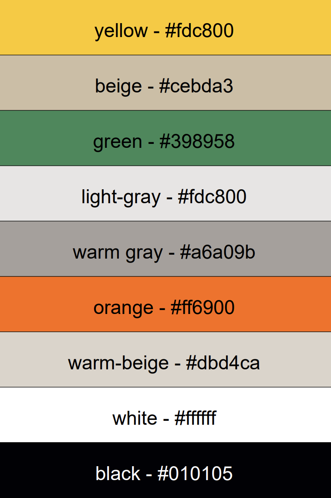

# Frontend architecture

The frontend is a Next.js 14 App Router application written in TypeScript. It is a single-page dashboard: one route renders the property list, and all creation and deletion flows happen in modals. Server state comes from the NestJS API through RTK Query; there is no local database or server-side data fetching.

## Directory layout

```
frontend/
├── app/
│   ├── layout.tsx               root layout: Inter font, Header, Footer, StoreProvider
│   ├── page.tsx                 fetches properties, renders Loading / error / PropertyDashboard
│   ├── globals.css              Tailwind layers + shadcn-style CSS variable theme
│   └── icon.svg                 favicon
├── components/
│   ├── Header.tsx, Footer.tsx, Logo.tsx, Loading.tsx
│   ├── PropertyDashboard.tsx    table with expandable buildings/units, delete + create actions
│   ├── PropertyCreationModal.tsx
│   ├── PropertyCreationSteps/
│   │   ├── Step1GeneralInfo.tsx     property data, contacts, PDF upload
│   │   ├── Step2BuildingData.tsx    building list + form
│   │   ├── Step3Units.tsx           unit entry modes
│   │   ├── Step3UnitsTable.tsx      sortable, filterable, inline-editable table
│   │   ├── QuickAddUnit.tsx
│   │   ├── BulkUnitPattern.tsx
│   │   └── BulkUnitImport.tsx       CSV import
│   ├── CreateContactModal.tsx
│   ├── DeletePropertyModal.tsx, DeleteBuildingModal.tsx, DeleteUnitModal.tsx
│   └── ui/                      button, dialog (Radix + class-variance-authority)
├── lib/
│   ├── store/
│   │   ├── index.ts             makeStore()
│   │   ├── StoreProvider.tsx    client-side Provider, one store per browser session
│   │   ├── hooks.ts             typed useAppDispatch / useAppSelector
│   │   └── api/                 RTK Query: index (base), properties, buildings, units, contacts
│   ├── colors.ts                palette constants mirrored in tailwind.config.ts
│   └── utils.ts                 cn() helper (clsx + tailwind-merge)
├── types/
│   ├── property.ts
│   └── propertyForm.ts          wizard form state (PropertyFormData, Building, Unit)
└── __tests__/test-utils.tsx     render() wrapper with a fresh Redux store
```

## Rendering model

`app/layout.tsx` is a server component that wraps the page in `StoreProvider` (a client component). Everything below it that uses hooks is marked `'use client'`. The root layout fixes the header and footer and pads `<main>` so content never slides under them.

`app/page.tsx` is the only route. It calls `useGetPropertiesQuery()` and renders:

- `Loading` while the first request is in flight,
- an error panel if the API is unreachable,
- `PropertyDashboard` with the property list otherwise.

## Data layer

### Store

`lib/store/index.ts` builds the store with the RTK Query reducer and middleware only; there are no hand-written slices. `StoreProvider` creates the store once with `useRef`, which is the recommended pattern for the App Router so each browser tab has its own cache.

### API slices

`lib/store/api/index.ts` defines a base `createApi` with `fetchBaseQuery` pointed at `NEXT_PUBLIC_API_URL` (default `http://localhost:3001`) and four tag types: `Property`, `Building`, `Unit`, `Contact`. Each resource file calls `api.injectEndpoints` and exports the generated hooks:

| File | Hooks |
| --- | --- |
| `properties.ts` | `useGetPropertiesQuery`, `useGetPropertyQuery`, `useCreatePropertyMutation`, `useUpdatePropertyMutation`, `useDeletePropertyMutation`, `useParsePdfMutation` |
| `buildings.ts` | list (optionally by property), get, create, update, delete |
| `units.ts` | list (optionally by building), get, create, update, delete |
| `contacts.ts` | `useGetContactsQuery`, `useGetContactQuery`, `useCreateContactMutation` |

Cache invalidation uses the `LIST` tag convention: queries provide `{ type, id }` for every row plus `{ type, id: 'LIST' }`, and mutations invalidate the affected id and the list, so the dashboard refetches automatically after any create or delete.

The same files also hold the TypeScript interfaces for API payloads (`Property`, `CreatePropertyDto`, `ParsedPropertyData`, and so on). They mirror the backend DTOs by hand; there is no shared package.

`parsePdf` is a mutation that builds a `FormData` body, so RTK Query sends it as multipart without a content-type override.

## Property creation wizard

`PropertyCreationModal` owns a single `PropertyFormData` object (see `types/propertyForm.ts`) and a `step` counter. Each step receives `formData` and an `onUpdate(partial)` callback, so the steps are stateless with respect to the overall form.

1. **Step1GeneralInfo**
   - Management type toggle (WEG / MV), name, property number, land registry, notary and technical fields.
   - Contact selectors backed by `useGetContactsQuery`, with "create new" opening `CreateContactModal`.
   - PDF upload: calls `useParsePdfMutation`, then maps `ParsedPropertyData` into the form. Buildings get generated client ids; units are matched to buildings by `buildingCode`; extracted manager and accountant details are kept in `extractedPropertyManager` / `extractedAccountant` so the contact modal can be pre-filled.
2. **Step2BuildingData**: a list of buildings with an add/edit form. The parent is told via `onEditingChange` while a form is open so navigation can be blocked.
3. **Step3Units**: four entry modes that all append to `formData.units`:
   - `QuickAddUnit`: single-unit form.
   - `BulkUnitPattern`: generates N units from a start number, type, building and shared attributes.
   - `BulkUnitImport`: parses a CSV in the browser (header-based column matching, see `example-units-import.csv`) and reports accepted and rejected rows.
   - `UnitsTable` (`Step3UnitsTable.tsx`): sort, filter by building or type, multi-select delete, duplicate, and inline cell editing.

On submit, the modal groups units by `buildingId`, strips empty strings with `omitEmpty`, converts numeric strings to numbers, and sends one nested `CreatePropertyDto` to `POST /properties`. Form values are kept as strings in state so inputs stay controlled; conversion happens only at submit time.

Form validation is done with plain React state and per-field checks in each step. `react-hook-form` and `zod` are present in `package.json` but not used by the current components.

## Dashboard

`PropertyDashboard` renders properties as expandable rows. Expanding a property fetches its buildings with `useGetBuildingsQuery(propertyId)`; expanding a building fetches units with `useGetUnitsQuery(buildingId)` (skipped until opened). Delete buttons open the corresponding confirmation modal, and the create button opens the wizard.

## Styling

- **Tailwind CSS** with the shadcn-style CSS variable theme in `globals.css` (`--background`, `--primary`, `--muted`, etc.) exposed as `bg-background`, `text-muted-foreground` and similar classes.
- **Brand palette** under the `brand` key in `tailwind.config.ts` (`bg-brand-green`, `text-brand-yellow`, `bg-brand-beige/20`), mirrored as constants in `lib/colors.ts`:

  

- **Inter** loaded through `next/font/google` and set as the body font.
- **Radix UI** primitives (`dialog`, `select`, `dropdown-menu`, `label`, `slot`) wrapped in `components/ui/` using `class-variance-authority` and the `cn()` helper.
- **lucide-react** for icons, including the `Building2` glyph used in `Logo`.

## Testing

Jest runs in `jest-environment-jsdom` with `babel-jest` and the `next/babel` preset. `@/` resolves to the frontend root and CSS imports are stubbed with `identity-obj-proxy`.

`__tests__/test-utils.tsx` re-exports React Testing Library with a `render` that wraps components in a fresh Redux store, so components that call RTK Query hooks can be rendered. Tests for the dashboard, the wizard modal and each step live in `components/__tests__/` and `components/PropertyCreationSteps/__tests__/`, and mock the API hooks with `jest.mock`.

```bash
cd frontend
npm test
npm run test:coverage
```

## Technology choices

- **Next.js App Router** for the file-based layout, built-in font loading and a production-ready build, even though the app is currently a single client-rendered page.
- **Redux Toolkit + RTK Query** instead of a lighter store because request caching, tag-based invalidation and generated hooks remove most data-fetching boilerplate from components.
- **Tailwind + Radix** for accessible primitives with full styling control and no runtime CSS-in-JS.
- **Client-side CSV parsing** keeps the import flow inside the wizard: rows are validated in the browser and submitted together with the rest of the property.
- **Jest + React Testing Library** to test behaviour (clicks, form input, rendered text) rather than implementation details.

## Configuration

| Variable | Description |
| --- | --- |
| `NEXT_PUBLIC_API_URL` | Backend base URL; defaults to `http://localhost:3001` |

`frontend/Dockerfile` runs `next dev`, and `docker-compose.yml` sets `NEXT_PUBLIC_API_URL=http://localhost:3001` because requests originate from the browser, not from inside the container network.
